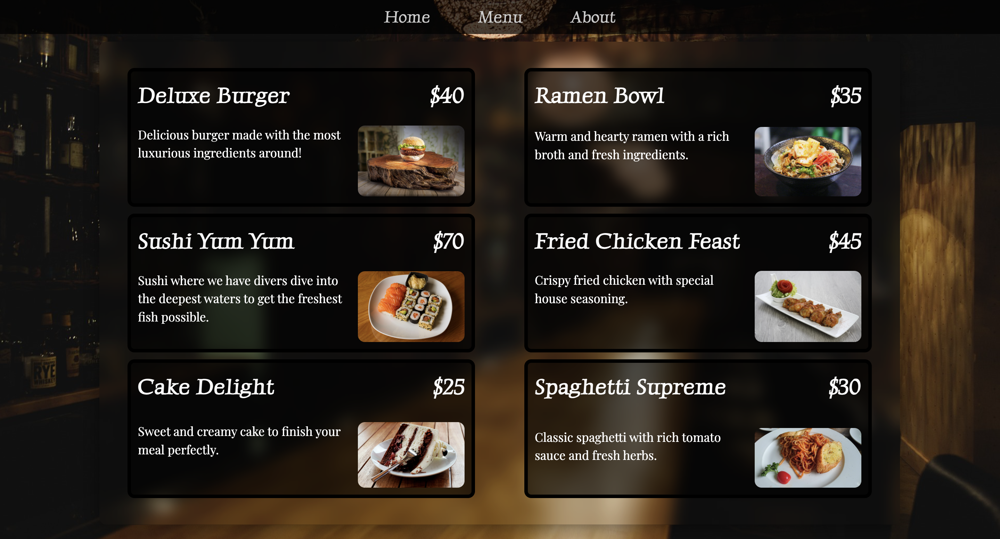
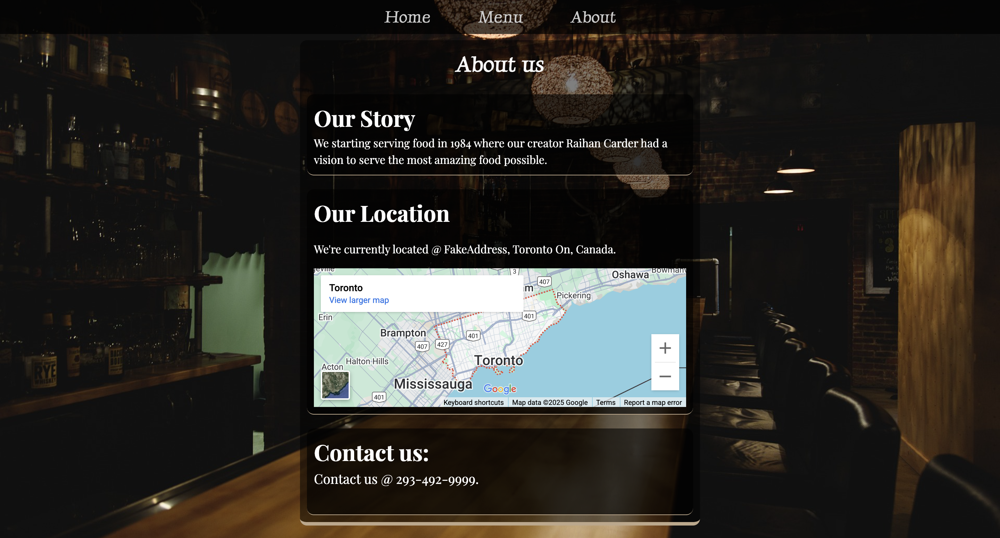

# Restaurant Page

This project I focused on making my entire DOM in Javascript and making my code modular by using Webpack. This project helped me learn how to use Webpack to bundle all my files and how to use Import/Export in Javascript.

## Features

- Navigate through the pages which include: Home/Menu/About
- Full Menu with picture and information
- Map in About section to help you find the restaurant!
- Clean and Modern UI

[Live Demo](https://raihancarder.github.io/restaurant-page/)

## Screenshots

## Installation

1. Clone the repo  
   `git clone https://github.com/raihanCarder/restaurant-page.git`

2. Navigate to the folder  
   `cd restaurant-page`

3. Open `index.html` in your browser (or run with Live Server)

## Tech Stack
- Javascript
- HTML
- CSS

Created by Raihan Carder(https://github.com/raihanCarder)  
Feel free to reach out!

